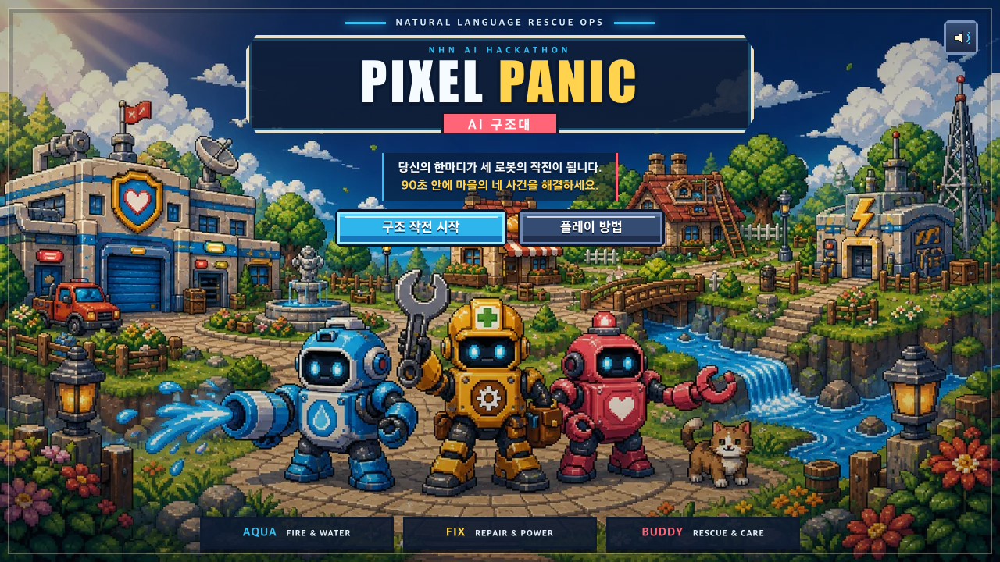

# PIXEL PANIC — AI 구조대

자연어로 `AQUA`, `FIX`, `BUDDY` 세 구조 로봇을 지휘해 90초 안에 도트 마을의 네 사고를 해결하는 NHN AI 해커톤 예선용 구조 퍼즐 게임입니다.

[PIXEL PANIC 공개 데모](https://pixel-panic-ai-rescue.vercel.app) · 데스크톱 또는 모바일 가로 화면 권장



## 아키텍처

```text
브라우저 → Vercel Next.js 프런트엔드 → OCI API Gateway HTTPS
                                      → OCI Ubuntu 22.04 Fastify API
                                      → OpenAI Responses API
```

- 프런트엔드: Next.js 16.3, React 19.2, TypeScript, Phaser
- 백엔드: Node.js 20, Fastify, OpenAI Node SDK, Docker
- 그래픽: Pillow 기반 결정론적 에셋과 176개 런타임 PNG/WebP
- 보호: 6초 AI timeout, IP당 분당 10회, 동시 burst 3회, 60초/100개 캐시, origin allowlist
- 장애 대응: OCI/OpenAI/네트워크/429/5xx에서 브라우저 `LOCAL` fallback으로 전체 플레이 유지

## 최초 1회 설치

Node.js 20 LTS와 Python 3가 필요합니다.

```bash
git clone https://github.com/KorTechTim/aihackathon_pre.git
cd aihackathon_pre
./scripts/bootstrap_dev.sh
```

스크립트는 `npm ci`, `backend` 의존성, 프로젝트 전용 `.venv`, Pillow, Playwright Chromium을 반복 실행 가능한 방식으로 준비합니다. Chromium만 다시 설치하려면 다음을 실행합니다.

```bash
npx playwright install chromium
```

## 개발 실행

```bash
npm run dev
```

브라우저에서 `http://localhost:3000`을 엽니다. 로컬 `OPENAI_API_KEY`가 없으면 `/api/plan`이 동일한 구조의 fallback 계획을 반환합니다.

## 환경변수

`.env.example`을 참고합니다. 비밀값이 든 `.env*` 파일은 Git에서 제외됩니다.

| 변수 | 위치 | 설명 |
|---|---|---|
| `NEXT_PUBLIC_API_BASE_URL` | Vercel | OCI API Gateway 자동 생성 HTTPS 주소, 끝 `/` 제외 |
| `OPENAI_API_KEY` | OCI backend | 서버 전용 OpenAI 키 |
| `OPENAI_MODEL` | OCI backend | GPT-5.6 계열 모델 |
| `ALLOWED_ORIGINS` | OCI backend | 허용 Vercel origin 목록 |

OCI 전환 전 로컬 호환용 Next Route도 `OPENAI_API_KEY`를 읽을 수 있지만, production에서는 `NEXT_PUBLIC_API_BASE_URL`을 설정하고 Vercel의 OpenAI 키를 제거해야 합니다.

## 검증 명령

```bash
npm run assets:verify   # 그래픽 규격·예산·매니페스트
npm run typecheck      # 프런트와 backend TypeScript
npm run test:unit      # 상태 모델·24개 priority 순열·통계
npm run test:backend   # health/plan/fallback/rate/cache/CORS/logging
npm run build:test     # QA debug snapshot을 포함한 production build
npm run qa:full        # 전체 플레이/fallback/순서/종료 경합
npm run ci             # 위 검증 전체
```

`qa:full`은 빌드가 끝난 상태에서 임시 production 서버를 자동으로 실행하고 종료합니다. 실제 유료 OpenAI 호출은 기본 테스트에 포함되지 않습니다.

## OCI API Gateway 확인

```bash
API_BASE_URL=https://<generated-gateway-hostname> npm run qa:oci-api
RUN_LIVE_AI_TEST=1 API_BASE_URL=https://<generated-gateway-hostname> npm run qa:oci-api
```

첫 명령은 health와 입력 검증만 확인합니다. `RUN_LIVE_AI_TEST=1`일 때만 계획 요청을 한 번 실행합니다. VM, Docker, NSG, systemd, API Gateway 배포 절차는 [infra/oci/README.md](infra/oci/README.md)에 있습니다.

## 에셋 생성

완료된 그래픽을 재생성할 필요는 없습니다. 소스 수정 후에만 아래 명령을 사용합니다.

```bash
npm run assets:generate
npm run assets:verify
```

## 주요 문서

- [그래픽 작업 지시서](PIXEL_PANIC_GRAPHICS_4_PHASE_WORK_ORDER_KO.md)
- [Phase 3 결과](PHASE_3_REPORT.md) / [Phase 4 최종 결과](PHASE_4_FINAL_REPORT.md)
- [통합 에셋 매니페스트](frontend/public/assets/pixel-panic/manifests/asset-manifest.json)
- [OCI 배포 문서](infra/oci/README.md)
- `PHASE_1_STABILIZATION_REPORT.md`
- `PHASE_2_OCI_BACKEND_REPORT.md`
- `PHASE_3_TEST_HARDENING_REPORT.md`
- `POST_PHASE4_STABILIZATION_FINAL_REPORT.md`

본 저장소의 캐릭터, UI, 배경, 효과와 로고는 이 프로젝트를 위해 제작한 오리지널 에셋입니다.
