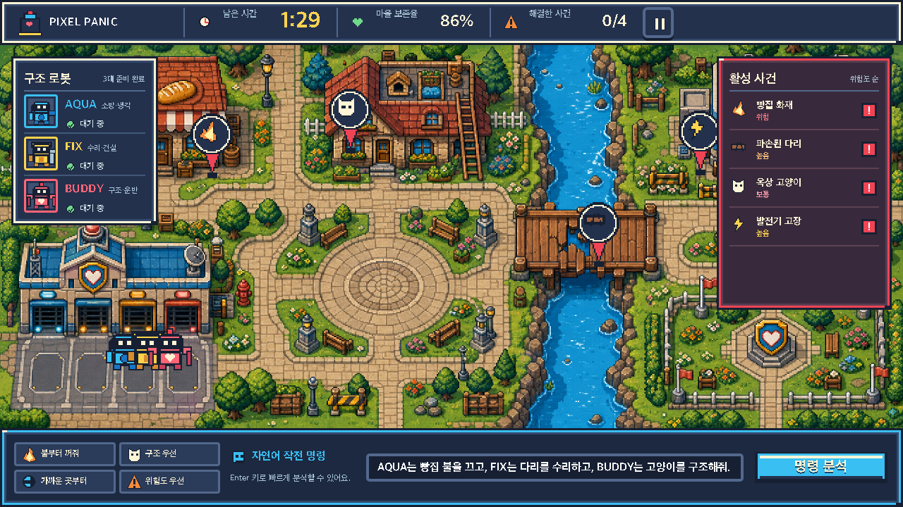

# PIXEL PANIC — AI 구조대

자연어로 `AQUA`, `FIX`, `BUDDY` 세 구조 로봇을 지휘해 90초 안에 도트 마을의 네 가지 사고를 해결하는 캐주얼 구조 퍼즐 게임입니다.



## 현재 구현 상태

그래픽 작업 지시서의 **Phase 2 — 마을 맵·건물·사건 오브젝트**까지 구현했습니다.

- 타이틀, 로딩, 90초 플레이, 성공, 실패 화면
- 자연어 명령 입력과 추천 명령 4종
- AI 분석 상태와 로봇별 작전 미리보기
- Phaser 3 기반 로봇 배정선·출동 연출
- 9-slice 패널, 4상태 버튼, HUD·사건·행동 아이콘
- AQUA·FIX·BUDDY 상태 초상화와 S/A/B/C/F 등급
- 데스크톱 및 모바일 가로 비율 대응, 모바일 세로 회전 안내
- 40×17 고정 화면 픽셀 아트 마을과 4개 사건 마커
- 건물·교량·발전기·소품 상태별 P0 에셋 41종
- 12개 레이어 맵, 충돌 680셀, 로봇 스폰과 사건 상호작용 데이터
- 다리 수리 전 발전기 접근 불가 의존성을 포함한 자동 경로 검사

월드 맵과 사건 마커는 Phase 2 에셋으로 교체했습니다. 로봇·주민·고양이와 실제 화재·연기·스파크 애니메이션은 Phase 3 범위입니다. Phase 1 UI는 기능 골격은 동작하지만 스타일 보드 수준의 시각 품질에는 미달해 재디자인 항목으로 남아 있습니다.

## 실행 방법

Node.js 20.9 이상이 필요합니다.

```bash
npm install
npm run dev
```

브라우저에서 `http://localhost:3000`을 엽니다.

## 검수 명령

```bash
npm run assets:verify
npm run build
npm run qa:smoke
npm run qa:screenshots
npm run qa:phase2
```

`qa:smoke`와 `qa:screenshots`는 실행 중인 앱을 기본적으로 `http://127.0.0.1:3100`에서 확인합니다. 다른 주소라면 `PIXEL_PANIC_URL` 환경 변수를 사용합니다.

## 주요 문서

- [그래픽 4-Phase 작업 지시서](PIXEL_PANIC_GRAPHICS_4_PHASE_WORK_ORDER_KO.md)
- [Phase 1 결과 보고서](PHASE_1_REPORT.md)
- [Phase 2 결과 보고서](PHASE_2_REPORT.md)
- [Phase 2 이미지 생성 프롬프트](assets-src/pixel-panic/world/reference/PHASE_2_IMAGEGEN_PROMPTS.md)
- [스타일 보드 생성 프롬프트](assets-src/pixel-panic/style/STYLE_BOARD_PROMPT.md)
- [팔레트](assets-src/pixel-panic/style/PALETTE.md)
- [스타일 규칙](assets-src/pixel-panic/style/STYLE_RULES.md)
- [에셋 출처 기록](ASSET_PROVENANCE.csv)

## 기술 구성

- Next.js 16 + React 19 + TypeScript
- Phaser 3 (`pixelArt`, `roundPixels`, `antialias: false`)
- 정적 RGBA PNG 에셋과 nearest-neighbor 렌더링
- Playwright 기반 상호작용·반응형 화면 검수

본 저장소의 캐릭터, UI, 배경과 로고는 이 프로젝트를 위해 새로 제작한 오리지널 에셋입니다.
