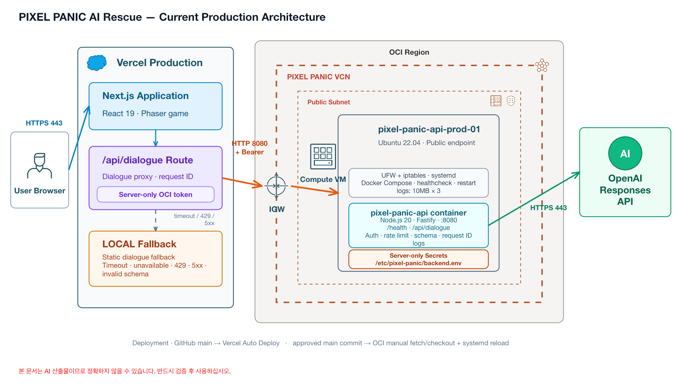

# PIXEL PANIC — AI 구조대

연쇄적으로 번지는 마을 사고를 클릭으로 분석하고 `AQUA`, `FIX`, `BUDDY`를 올바른 순서로 배치해 구조 콤보를 만드는 NHN AI 해커톤 예선용 도트 전략 게임입니다.

[PIXEL PANIC 공개 데모](https://pixel-panic-ai-rescue.vercel.app) · 데스크톱 또는 모바일 가로 화면 권장


## 현재 플레이 범위

- 키보드나 자연어 입력 없이 클릭·터치만으로 한 판을 완주합니다.
- 지도 빈 공간을 좌우로 드래그해 양쪽 메뉴 뒤에 가려진 마을 끝까지 탐색할 수 있습니다.
- 항구·산악·운하·철도처럼 구조와 건물 배치가 완전히 다른 신규 맵 4종을 포함한 오리지널 픽셀 맵 9종이 웨이브와 재도전에 따라 순환합니다.
- 신규 지형에서는 NPC, 사고 현장, 로봇 시작점과 이동 경로도 맵 구조에 맞춰 달라집니다.
- 지도 주민을 클릭하면 이름·직업·성격과 현재 재난 상황을 반영한 AI 말풍선 대사가 생성됩니다.
- 구조 로봇을 선택하면 해당 사고에서 가능한 행동이 지도 위 명령 팝업으로 열립니다.
- 로봇이 실제 사고 지점에 도착하면 해당 재난에 맞는 AI 안전 상식 3지선다 퀴즈가 열리고, 정답을 맞혀야 현장이 해결됩니다.
- 옥상 고양이 사고에서는 BUDDY를 좌우로 움직여 1초 뒤 추락하는 고양이를 쿠션으로 받는 전용 팝업 미니게임이 열립니다. 놓치면 사고가 남아 다시 도전할 수 있습니다.
- 광장 폭탄 위협에서는 FIX가 도착한 뒤 본부 여성형 AI `루나`의 무전 암호를 듣고 빨강·파랑 전선 중 하나를 클릭하는 해체 미니게임이 열립니다. 정답 신호는 시도마다 달라집니다.
- 3분 30초 동안 화재, 침수, 복합 재난의 3개 웨이브가 진행되며, 현재 웨이브의 재난을 모두 해결하면 예약 시각을 기다리지 않고 마을 뉴스와 함께 다음 스테이지로 출동합니다.
- 실제 판정에 사용하는 사고 11개와 연쇄 사고 체인 2개가 있습니다.
- 행동 순서로 판정하는 로봇 콤보 5개와 선택형 대화 이벤트 4개가 있습니다.
- 타이틀과 구조 작전에 서로 다른 오리지널 8비트 BGM을 사용하고 선택·출동·해결·콤보·결과 효과음을 Web Audio로 실시간 합성합니다.
- 게임 엔진이 사고 확산, 콤보, 점수, 등급을 결정론적으로 계산합니다.
- 각 웨이브 완료 전환과 결과 화면에서는 실제 작전 기록을 바탕으로 AI 마을 뉴스와 주민 인터뷰를 발행합니다.
- GPT-5.6은 NPC·로봇 대사, 현장별 안전 상식 퀴즈와 결과 뉴스를 생성하며 실패하면 즉시 로컬 콘텐츠를 사용합니다. 안전 퀴즈는 최근 48개 이력과 8가지 출제 관점을 사용해 재시작 후에도 같은 문제를 피하고, 중복 응답은 자동 재생성합니다. 폭탄 해체에서는 현실 지식 없이 정답 색을 비유하는 본부 AI 무전 힌트만 생성합니다.

기본 조작은 `사고 선택 → 로봇 선택 → 행동 선택 → 현장 도착 → 안전 퀴즈 또는 구조 미니게임`입니다. 선행 조치로 확산을 막고, 아래 대표 순서처럼 역할을 이어 붙이면 보너스 콤보를 발견할 수 있습니다.

```text
FIX 전력 차단 → BUDDY 주민 대피 → FIX 가스 차단 → AQUA 화재 진압
BUDDY 부품 운반 → FIX 발전 시설 복구 → AQUA 수위 감소 → FIX 임시 다리 → BUDDY 구조
```

세부 규칙은 [게임 설계](docs/GAME_DESIGN.md), AI의 정확한 역할은 [AI 활용 기록](docs/AI_USAGE.md)에 정리했습니다.

## 아키텍처



브라우저는 Vercel의 same-origin API만 호출하며 OCI 주소, 공유 토큰, OpenAI API 키를 알지 못합니다.

```text
브라우저 게임 ── 결정론 게임 엔진(로컬, 항상 동작)
       │
       └─ 주민 말풍선·선택형 대사 /api/dialogue
          현장 안전 상식 퀴즈 /api/quiz
          폭탄 해체 본부 AI 무전 /api/bomb-hint
          결과 기사·주민 인터뷰 /api/news
          → Vercel Next.js 서버 Route
          → OCI Ubuntu VM:8080 /api/dialogue · /api/quiz · /api/bomb-hint · /api/news
          → OpenAI Responses API (gpt-5.6-luna)
```

- Vercel Route는 서버 전용 Bearer 토큰으로 OCI Fastify API를 호출합니다.
- OpenAI API 키는 OCI VM의 저장소 밖 환경파일에만 둡니다.
- OCI/OpenAI/네트워크/429/5xx/잘못된 응답/5초 timeout은 상황별 정적 대사·안전 문제·결과 기사로 폴백합니다.
- NPC 대사는 캐릭터 설정과 현재 게임 사실만 사용합니다. 선택지는 기존 대화 이벤트에만 미리 정의돼 있으며 LLM은 선택지, 규칙, 점수, 승패를 만들지 않습니다.
- 퀴즈는 현재 사고·행동·로봇·위험도만 사용한 초급 3지선다 구조화 출력입니다. 정답 전에는 엔진이 임무를 완료하지 않으며 정답 판정과 사고 해결은 클라이언트의 결정론 규칙이 수행합니다.
- 폭탄 무전은 결정론 엔진이 미리 고른 빨강·파랑 정답 색과 시도 횟수만 받아, 현실 해체 지식 없이 색을 연상시키는 한 문장 암호를 만듭니다. 전선 정답과 성공·실패는 LLM이 바꿀 수 없습니다.
- 결과 뉴스는 결정론 엔진이 확정한 승패·등급·점수·보존율·구조 인원·해결 사고·콤보만 전달합니다. LLM은 이 사실을 바꾸지 않고 제목, 기사와 지정 주민의 인터뷰 문장만 작성합니다.
- 기존 `/api/plan`과 OCI `/v1/plan`은 이전 데모 호환용으로 남아 있지만 현재 게임 UI는 호출하지 않습니다.
- Vercel은 `main`을 자동 배포하고 OCI는 승인된 `main` 커밋을 수동 반영합니다.

[편집 가능한 OCI PowerPoint](docs/architecture/pixel-panic-current-architecture.pptx) · [구조화 모델](docs/architecture/pixel-panic-current-architecture-model.json)

프런트엔드는 Next.js 16.3, React 19.2, TypeScript, Phaser를 사용하고 백엔드는 Node.js 20, Fastify, OpenAI Node SDK, Docker로 구성됩니다.

## 최초 1회 설치

지원 Node.js 범위는 `>=20 <23`입니다. 그래픽 생성 스크립트까지 실행하려면 Python `>=3.10`이 필요합니다.

```bash
git clone https://github.com/KorTechTim/aihackathon_pre.git
cd aihackathon_pre
./scripts/bootstrap_dev.sh
```

## 로컬 실행

```bash
npm run dev
```

브라우저에서 `http://localhost:3000`을 엽니다. OCI 환경변수가 없더라도 `/api/dialogue`, `/api/quiz`, `/api/bomb-hint`, `/api/news`가 로컬 대사·문제·무전·기사를 반환하므로 첫 화면부터 결과 화면까지 플레이할 수 있습니다.

OCI backend만 개발할 때는 저장소 밖 환경파일에 테스트 공유 토큰을 설정한 뒤 실행합니다.

```bash
npm --prefix backend run dev
```

## 환경변수

`.env.example`과 `infra/oci/env.production.example`에는 변수 이름과 placeholder만 있습니다. 실제 비밀 파일은 Git에 넣지 않습니다.

| 변수 | 위치 | 설명 |
|---|---|---|
| `OCI_BACKEND_URL` | Vercel server | `http://OCI_PUBLIC_IP:8080` |
| `OCI_BACKEND_TOKEN` | Vercel server | OCI 공유 토큰과 같은 서버 전용 값 |
| `OCI_BACKEND_TIMEOUT_MS` | Vercel server | 권장 5000ms |
| `OPENAI_API_KEY` | OCI backend | OpenAI 서버 전용 키 |
| `OPENAI_MODEL` | OCI backend | 기본 `gpt-5.6-luna` |
| `OPENAI_TIMEOUT_MS` | OCI backend | 최대 5000ms |
| `BACKEND_SHARED_TOKEN` | OCI backend | 최소 32바이트 공유 토큰 |
| `TRUST_PROXY_HOPS` | OCI backend | Vercel 전달 IP 한 홉 신뢰 |

운영 Vercel에는 OpenAI 키를 두지 않습니다. `NEXT_PUBLIC_ENABLE_TEST_DEBUG`는 QA 빌드에서만 `1`이며 비밀값이 아닙니다.

## 검증 명령

```bash
npm run policy:verify   # 경로·비밀정보·버전 정책
npm run assets:verify   # 그래픽 규격·예산·매니페스트
npm run typecheck       # 프런트와 backend TypeScript
npm run test:unit       # 게임 엔진과 Vercel 프록시
npm run test:backend    # 인증/health/dialogue/quiz/bomb-hint/news/fallback/rate limit
npm run build:test      # QA debug snapshot 포함 production build
npm run qa:full         # 클릭 완주/fallback/반응형/종료 테스트
npm run ci              # 로컬 검증 전체
npm run ci:docker       # backend 이미지와 컨테이너 health
```

브라우저 QA는 same-origin `/api/dialogue`, `/api/quiz`, `/api/bomb-hint`, `/api/news`를 mock해 유료 OpenAI 요청을 실행하지 않습니다. 실제 VM 점검용 `qa:oci-api`는 인증 정보가 보안 환경변수로 주입된 관리 환경에서만 실행합니다.

## 주요 문서

- [게임 설계와 결정론 규칙](docs/GAME_DESIGN.md)
- [AI 활용 기록](docs/AI_USAGE.md)
- [QA 체크리스트](docs/QA_CHECKLIST.md)
- [이번 Codex 작업 범위와 완료 기준](docs/CODEX_WORK_ORDER.md)
- [OCI 배포 문서](infra/oci/README.md)
- [통합 에셋 매니페스트](public/assets/pixel-panic/manifests/asset-manifest.json)

본 저장소의 캐릭터, UI, 배경, 효과, 로고와 칩튠 사운드는 이 프로젝트를 위해 제작한 오리지널 에셋입니다. 오픈소스 런타임 라이선스는 각 패키지와 lockfile을 기준으로 확인할 수 있습니다.
